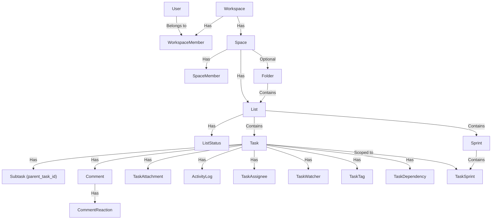

# Teamority MVP Documentation Audit & Gap Analysis

This document serves as the central tracking file for the Teamority MVP architecture audit. It identifies logical gaps, inconsistencies, and potential architectural mistakes across all specification files in the `docs/` folder, mapping out data dependencies, and proposing solutions and post-MVP enhancements.

---

## 1. Entity Dependency & Lifecycle Map

To ensure data integrity, the system's core entities are tightly nested. Deletions cascade down this tree. Below is the relationship map and cascade behavior.

### Cascade Deletion Rules

When top-level containers are deleted, their children are permanently deleted in a cascading fashion:

| Deletion Target | Cascaded Records Purged | Storage (Cloudflare R2) Action |
|:---|:---|:---|
| **Workspace** | Spaces, SpaceMembers, Folders, Lists, ListStatuses, Tasks, Subtasks, Comments, CommentReactions, Attachments, Sprints, ActivityLogs, WorkspaceMembers | Permanent deletion of all workspace-associated file uploads |
| **Space** | SpaceMembers, Folders, Lists (and all nested tasks, comments, attachments) | Permanent deletion of all files uploaded to tasks within that Space |
| **Folder** | *Option A:* Delete folder only (Lists moved to Space root)  *Option B:* Delete folder + contents (purges Lists, Tasks, Comments, Attachments) | If Option B, deletes all files belonging to lists inside the Folder |
| **List** | ListStatuses, Tasks, Comments, CommentReactions, Attachments, TaskSprint associations | Permanent deletion of all files uploaded to tasks in that List |
| **Task** | Subtasks, Comments, CommentReactions, Attachments, ActivityLogs, Assignees, Watchers, Dependencies | Permanent deletion of files attached to this specific task and its comments |
| **Comment** | CommentReactions, Attachments (if uploaded inline in the comment) | If comment is soft-deleted, files remain. If hard-deleted, files are purged from storage |

---

## 2. Inconsistencies & Logical Gaps

### Gap 1: Guest Role Member Visibility & Privilege Escalation
* **Source of Contradiction / Conflict**: 
  - [permission-model.md](file:///home/master/Smit/teamority/docs/permission-model.md) (Lines 43, 60, 110, 213)
  - [workspace.md](file:///home/master/Smit/teamority/docs/workspace.md) (Line 104)
* **Problem**: The Guest role is defined in `permission-model.md` as having "no workspace-level visibility" and being unable to see the workspace member list (Line 43, Line 60). However, if a Space Owner/Admin grants a Guest the `Full Access` permission level inside a specific Space (Line 213), the Guest inherits the ability to `Manage Space Members (add, change permission, remove)` (Line 110). A Guest cannot choose members to add if they cannot view the workspace member list, creating a functional deadlock. Additionally, a Guest having `Full Access` creates a security privilege escalation risk where external collaborators can invite other guests/members or kick out internal members.
* **Mitigation**:
  1. **Enforce Role Constraints**: Restrict Guests from being assigned the `Full Access` permission level inside any Space. They should only be allowed `Edit` or `View` permissions.
  2. **Add Server-side Enforcement**: Ensure the `canPerformAction` utility rejects any attempt to add a Guest to a Space with `Full Access` permissions, or to promote a Guest to `Full Access`.

### Gap 2: Sole Owner Account Deletion Deadlock
* **Source of Contradiction / Conflict**: 
  - [authentication.md](file:///home/master/Smit/teamority/docs/authentication.md) (Lines 251, 460)
  - [workspace.md](file:///home/master/Smit/teamority/docs/workspace.md) (Lines 109, 247-254)
* **Problem**: `authentication.md` specifies that if a user is the Owner of any workspace, they must transfer ownership first before deleting their account (Lines 251, 460). However, if the Owner is the *only* member of the workspace, there is no other user to transfer ownership to, blocking the user from deleting their account entirely.
* **Mitigation**:
  - Implement a conditional check: If the deleting user is the Owner of a workspace, check if they are the **sole member** of that workspace. 
  - If they are the sole member, account deletion should automatically trigger a workspace cascade deletion (deleting the workspace and all its data).
  - If there are other members, prompt the owner to transfer ownership or delete the workspace manually before deleting their account.

### Gap 3: Synchronous Cascade Deletion Timeouts & R2 Orphans
* **Source of Contradiction / Conflict**: 
  - [workspace.md](file:///home/master/Smit/teamority/docs/workspace.md) (Lines 217-240)
  - [collaboration.md](file:///home/master/Smit/teamority/docs/collaboration.md) (Lines 402-404)
* **Problem**: Deleting a large workspace or a folder containing hundreds of lists and thousands of tasks synchronously in a single API call will likely trigger serverless execution timeouts (e.g., Vercel's default 15-second timeout). Additionally, if the database record is deleted first and the S3/R2 API fails or times out, orphaned files will remain in cloud storage indefinitely, incurring unnecessary costs.
* **Mitigation**:
  1. **Asynchronous Deletion Pattern**: Use a soft-deletion pattern. When a user requests deletion, set a `deleting_at` timestamp on the workspace/space/folder in the DB and return a `202 Accepted` response.
  2. **Background Queue/Job**: Use a background worker (or cron job via Upstash Redis/QStash) to fetch entities marked for deletion, delete attachments from Cloudflare R2 in chunks, and then permanently delete the database records.

### Gap 4: Sprint Auto-Close Incomplete Task Routing
* **Source of Contradiction / Conflict**: 
  - [sprint.md](file:///home/master/Smit/teamority/docs/sprint.md) (Lines 54-57, 125-136, 279-282)
* **Problem**: `sprint.md` and `development-plan.md` plan for an automated sprint auto-close mechanism via a cron job. If the cron job runs at the end of a sprint, there is no user present to specify where incomplete tasks should go (backlog vs. next sprint). Sprints closed automatically by the system currently default to hardcoded "Move to Backlog" (Line 56, Line 281), whereas manual closes force the user to make a choice (Line 129). This mismatch takes away control from teams using automation.
* **Mitigation**:
  - Add a **Sprint Strategy setting** at the List or Space level (e.g., `auto_close_strategy: "move_to_backlog" | "move_to_next_sprint" | "do_nothing"`).
  - When the cron job executes the auto-close, it reads the configured strategy and automatically migrates incomplete tasks accordingly.
  - If `move_to_next_sprint` is selected but no planned sprint exists, default to migrating them to the Backlog.

### Gap 5: Task Dependency Cycles
* **Source of Contradiction / Conflict**: 
  - [task.md](file:///home/master/Smit/teamority/docs/task.md) (Lines 170-172)
* **Problem**: A user can add a dependency where Task A is "blocked by" Task B, and Task B is "blocked by" Task A. While Line 170 states "Circular dependencies are not allowed", Line 172 says "No automatic enforcement in MVP — dependencies are informational only". This creates a contradiction for the implementation: if cycles are not allowed but there is no enforcement, the UI and API will easily allow cycles, leading to infinite loops in timeline calculations and progress rollups.
* **Mitigation**:
  - Add a cycle detection check (using depth-first search (DFS) traversal) on the backend when creating or updating task dependencies.
  - Reject the request with a `400 Bad Request` if adding the dependency path creates a loop.

<!-- Extra Feature need to add in development-plan.md-->

## 3. Roadmap Verification Plan

To integrate the audit checks into the `development-plan.md`, the following verification tasks must be completed during implementation:

### Phase 1 & 5 Verification: Permission and Role Validation
- [ ] Write integration tests for the `checkPermission()` function.
- [ ] Validate that Guest users cannot be added to a Space with `Full Access` permissions.
- [ ] Test Guest attempts to view the workspace member list via the API; verify it returns `403 Forbidden`.

### Phase 9 Verification: Dependency Loop Prevention
- [ ] Unit test the DFS cycle detection algorithm with nested and cross-linked task relationships.
- [ ] Verify that attempting to create a cyclic dependency returns a `400 Bad Request`.

### Phase 11 Verification: Sprint Auto-Close
- [ ] Test the cron job simulation to auto-close a sprint and verify incomplete tasks are migrated to the Backlog or next active sprint based on the list's auto-close policy.

